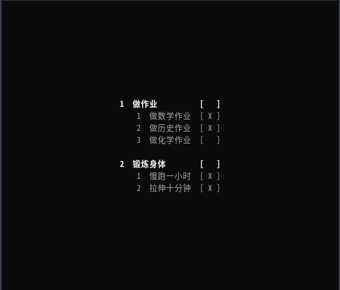

中文版 | [English Version](./README_EN.md)

## 如何使用

### 首页

打开终端并进入项目bin路径，执行`./daily`

> 管理基础数据及功能扩展请使用 `./daily <命令>` ，命令格式如下所示。

### 管理基础数据：任务与任务步骤

| 操作描述     | 命令格式                                              | 示例                   |
| ------------ | ----------------------------------------------------- | ---------------------- |
| 增加任务     | `{a,add} <TASK>...`                                   | `a '做家务' '锻炼'`    |
| 更新任务     | `{u,update} {<TASK_ID> <TASK>}...`                    | `u 1 '做作业' `        |
| 完成任务     | `{f,finish} <TASK_ID>... `                            | `f 1 2`                |
| 删除任务     | `{d,delete} <TASK_ID>... `                            | `d 1 2`                |
| 增加任务步骤 | `{t,task} <TASK_ID> {a,add} <STEP>...`                | `t 1 a '做数学作业'`   |
| 更新任务步骤 | `{t,task} <TASK_ID> {u,update} {<STEP_ID> <STEP>}...` | `t 1 u 1 '做物理作业'` |
| 完成任务步骤 | `{t,task} <TASK_ID> {f,finish} <STEP_ID>...`          | `t 1 f 1`              |
| 删除任务步骤 | `{t,task} <TASK_ID> {d,delete} <STEP_ID>...`          | `t 1 d 1`              |

### 功能扩展

| 操作描述 | 命令格式                           | 示例                                     |
| -------- | ---------------------------------- | ---------------------------------------- |
| 帮助     | `{h,help}`                         | `help`                                   |
| 写入配置 | `{c,config} {s,set} <KEY> <VALUE>` | `c set server_url http://localhost:8080` |
| 读取配置 | `{c,config} (g,get} <KEY>`         | `c get server_url`                       |
| 删除配置 | `{c,config} {d,delete} <KEY>`      | `c delete server_url`                    |
| 预览配置 | `{c,config} {l,list}`              | `c list`                                 |
| 登录     | `{l,login} <USERNAME> <PASSWORD>`  | `login username password`                |
| 同步     | `{s,sync}`                         | `sync`                                   |
| 导出     | `{e,export}`                       | `export`                                 |

