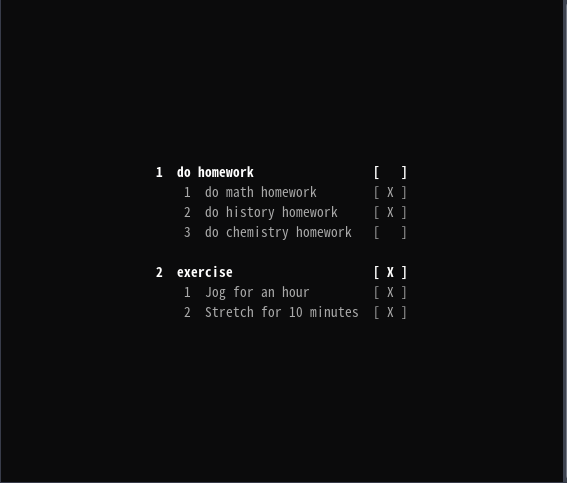

[中文版](./README.md)  | English Version
## How to use

### Home page

Open the terminal and change directory to the project bin path, execute `./daily`

> To manage basic data and extend functionality, please use `./daily <command>`. The command format is shown below.

### Manage base data for the task and step

| operation        | command                                               | example                         |
| ---------------- | ----------------------------------------------------- | ------------------------------- |
| add task         | `{a,add} <TASK>...`                                   | `a 'do housework' 'exercise'`   |
| update task      | `{u,update} {<TASK_ID> <TASK>}...`                    | `u 1 'do homework' `            |
| finish task      | `{f,finish} <TASK_ID>... `                            | `f 1 2`                         |
| delete task      | `{d,delete} <TASK_ID>... `                            | `d 1 2`                         |
| add task step    | `{t,task} <TASK_ID> {a,add} <STEP>...`                | `t 1 a 'do math homework'`      |
| update task step | `{t,task} <TASK_ID> {u,update} {<STEP_ID> <STEP>}...` | `t 1 u 1 'do physics homework'` |
| finish task step | `{t,task} <TASK_ID> {f,finish} <STEP_ID>...`          | `t 1 f 1`                       |
| delete task step | `{t,task} <TASK_ID> {d,delete} <STEP_ID>...`          | `t 1 d 1`                       |

### Extend functionality

| operation     | command                            | example                                  |
| ------------- | ---------------------------------- | ---------------------------------------- |
| help          | `{h,help}`                         | `help`                                   |
| set config    | `{c,config} {s,set} <KEY> <VALUE>` | `c set server_url http://localhost:8080` |
| get config    | `{c,config} (g,get} <KEY>`         | `c get server_url`                       |
| delete config | `{c,config} {d,delete} <KEY>`      | `c delete server_url`                    |
| list config   | `{c,config} {l,list}`              | `c list`                                 |
| login         | `{l,login} <USERNAME> <PASSWORD>`  | `l username password`                    |
| sync          | `{s,sync}`                         | `sync`                                   |
| export        | `{e,export}`                       | `export`                                 |
